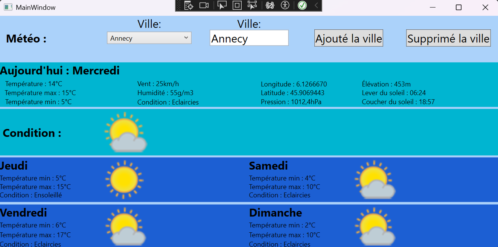

# 🌦 Application Météo WPF  

Une application météo développée en C# avec .NET WPF permettant d'afficher la météo d'une ville sélectionnée.  

## 🚀 Fonctionnalités  

- 🔍 Recherche de la météo par ville  
- 💾 Sauvegarde automatique de la dernière ville sélectionnée  
- 🌡️ Affichage des informations météo : température, humidité, conditions météorologiques  
- 🎨 Interface moderne et intuitive  

## 🛠 Technologies utilisées  

- C#  
- .NET WPF  
- API météo (ex: OpenWeatherMap)  

## 📸 Aperçu  

Ajoutez ici une capture d'écran de l'application.  

  

## 💻 Installation et exécution  

1. Clonez le projet :  
   ```sh  
   git clone https://github.com/votre-utilisateur/votre-repo.git
2. Ouvrez le projet dans Visual Studio

3. Ajoutez votre clé API météo dans le code

4. Compilez et exécutez

## 📝 Auteurs

- **Coene Alexandre** - [GitHub](https://github.com/AlexandreCoene) 
